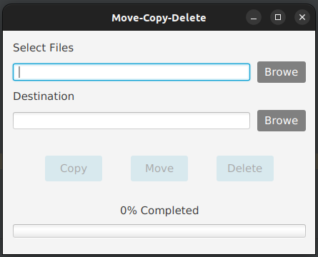

# Simple-File-Copy-Move-Delete

This is a simple file management program built using Java, JavaFX, and Scene Builder. It allows you to perform basic file operations such as copying, moving, and deleting files.



## Features

- Copy files from one location to another.
- Move files from one location to another.
- Delete files permanently.

## Prerequisites

Make sure you have the following installed before running the program:

- Java Development Kit (JDK)
- JavaFX
- Scene Builder

## Getting Started

Clone the repository:
   ```shell
   git clone https://github.com/RH-JavaFX-Projects/Simple-File-Copy-Move-Delete.git

